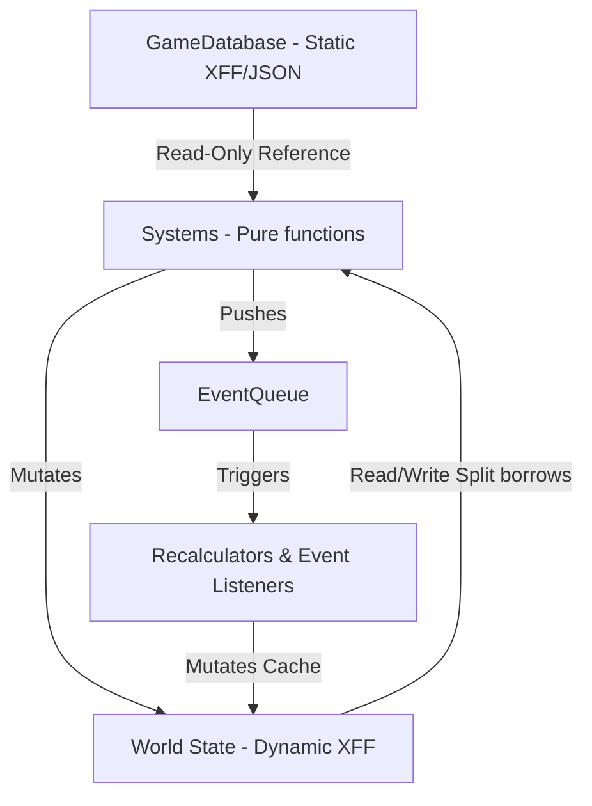

# Design Specification: Aion (Generalized TUI Game Engine)

A lightweight, zero-dependency, data-driven game state and simulation engine written in Rust. It is designed to handle high-complexity, turn-based, or time-scaled simulation games (Dwarf Fortress or Aurora 4X scale) without graphics or physics.

# Names


Aion: Hellenistic deity, associated with time, the orb or circle encompassing the universe, and the zodiac.
Nurtia: Almost forgotten Etruscan goddess of time fate destiny and chance.
Shiva: one of the primary deities of Hinduism, is the Supreme Lord who creates, protects and transforms the universe. Also God of Destruction.
Enki: Sumerian into Babylonian into Hittite into Assyrian (Mesopotamia in general) god of subterranean fresh waters, wisdom, crafts, magic and incantations.

---

## 1. Architectural Overview

The engine separates static rules (game configuration) from dynamic state (save files) and decouples systems using a compile-time generic Entity Component System (ECS) combined with an Event Queue.



---

## 2. Core Registry & State Representation

To facilitate clean serialization to/from `.xff` files and remain 100% type-safe without unsafe code, the engine uses a **Static Struct-of-Maps ECS**.

### 2.1 Entity representation
Entities are simple 32-bit identifiers:
```rust
#[derive(Debug, Clone, Copy, PartialEq, Eq, PartialOrd, Ord, Serialize, Deserialize)]
pub struct EntityId(pub u32);
```

### 2.2 Dynamic State (`World`)
The game state is a flat struct of `BTreeMap` tables. Keys are kept sorted to guarantee byte-for-byte deterministic serialization output.
```rust
pub struct World {
    next_entity_id: u32,
    
    // Core Component Tables (Sorted for deterministic Serde)
    pub name: BTreeMap<EntityId, String>,
    pub inventory: BTreeMap<EntityId, Inventory>,
    pub research_pool: BTreeMap<EntityId, ResearchPool>,
    pub active_effects: BTreeMap<EntityId, ActiveEffects>,
    pub modifier_state: BTreeMap<EntityId, ModifierState>,
    // Game-specific components are added here in the game project
}
```

---

## 3. Decoupled Event System

Systems communicate asynchronously by producing events. The core engine is agnostic to the game's actual event enum via generic parameterization.

### 3.1 Generic Queue
```rust
pub struct EventQueue<E> {
    pub events: Vec<E>,
}

impl<E> EventQueue<E> {
    pub fn push(&mut self, event: E) {
        self.events.push(event);
    }
}
```

### 3.2 System Ticks
Every tick passes a variable duration $\Delta t$ and a mutable event queue reference.
```rust
pub fn tick<E>(world: &mut World, db: &GameDatabase, dt: Duration, queue: &mut EventQueue<E>) {
    // 1. Run time-decay systems (e.g., buff counters)
    system_temporary_effects(world, dt, queue);
    
    // 2. Run active simulation systems
    system_research(world, db, dt, queue);
    system_production(world, db, dt, queue);
}
```

---

## 4. Static Database vs. Dynamic State

All constants, prerequisites, costs, and blueprints are loaded at startup into a read-only database.

* **`GameDatabase`**: Holds tech trees, resource definitions, item types. Loaded from XFF/JSON once.
* **`World`**: Holds active progress, current inventories, and timers. Saved/loaded during game session.

This boundary ensures:
1. **Tiny Save Files**: Blueprints are not duplicated in save states.
2. **Mod Safety**: Mod updates dynamically apply to existing saves without corrupting progress.

---

## 5. Cached Modifier & Effect System

To prevent expensive deep-nesting walks on every tick, modifiers (e.g., technology boons, status effects) are cached dynamically in the `ModifierState` component.

### 5.1 Recalculation Flow
1. When an event changes modifiers (e.g., `TechCompleted` or a `TemporaryEffect` expires), the system triggers a `ModifiersChanged` event.
2. The `system_modifier_recalculator` captures this event and re-evaluates all active modifiers for the affected entity, writing it to the `ModifierState` cache.
3. Other systems inspect the cache in $O(1)$ time.

### 5.2 Temporary Effects (Lazy Duration Check)
Temporary effects (e.g., "rebellion", "festival") live in the `ActiveEffects` component.
```rust
pub struct TemporaryEffect {
    pub id: String,
    pub remaining_duration: Duration,
    pub effects: Vec<EffectDefinition>,
}
```
* **Performance**: The engine only updates duration counters. Recalculation is executed exactly **twice** per effect (on startup and expiration), preventing tick-to-tick bottlenecks.

---

## 6. Validation & Save File Repair via Nemesis

Data-driven games are vulnerable to broken save files due to modified or uninstalled mods. We handle this using aggregated startup/loading validation.

### 6.1 Validation Routine
At startup, `validate_database` inspects the configuration for:
1. **Dangling Prerequisites**: Technologies requiring non-existent items.
2. **Circular Dependencies**: Closed loops in the research tree (e.g., $A \rightarrow B \rightarrow A$).
3. **Invalid Resources**: Costs or yields pointing to undefined resource keys.

### 6.2 Nemesis Save Repair
Using the `downcast_items` helper in [Nemesis](file:///home/xqhare/Adytum/Programming/rust/nemesis/src/error.rs), the loader aggregates validation errors and repairs them programmatically:

```rust
// Sanitizes the loaded World state from missing mod dependencies
pub fn repair_save(world: &mut World, db: &GameDatabase, errors: &NemesisCollection) {
    let validation_issues = errors.downcast_items::<ValidationError>();
    for issue in validation_issues {
        match issue {
            ValidationError::DanglingResource { entity, resource_id } => {
                if let Some(inv) = world.inventory.get_mut(entity) {
                    inv.materials.remove(resource_id);
                }
            }
            ValidationError::DanglingResearch { entity, .. } => {
                if let Some(pool) = world.research_pool.get_mut(entity) {
                    pool.active_project = None;
                }
            }
        }
    }
}
```

---

## 7. Testing Strategy

1. **Determinism Verification**: Ensures that running $N$ ticks sequentially produces the exact same state as saving, reloading, and continuing.
2. **Replay Regression Testing**: Runs predefined player inputs and matches generated events against a canonical execution log.
3. **Headless Fuzzing**: A random-action simulator ticks the engine 100,000 times to verify that no underflows, overflows, or panics occur.
